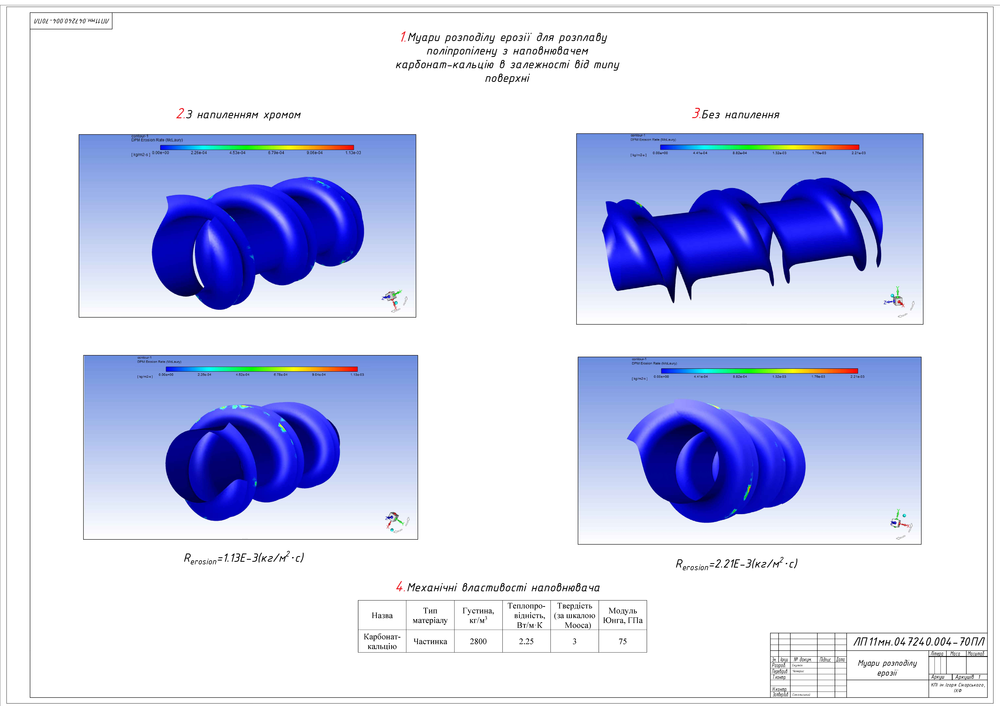
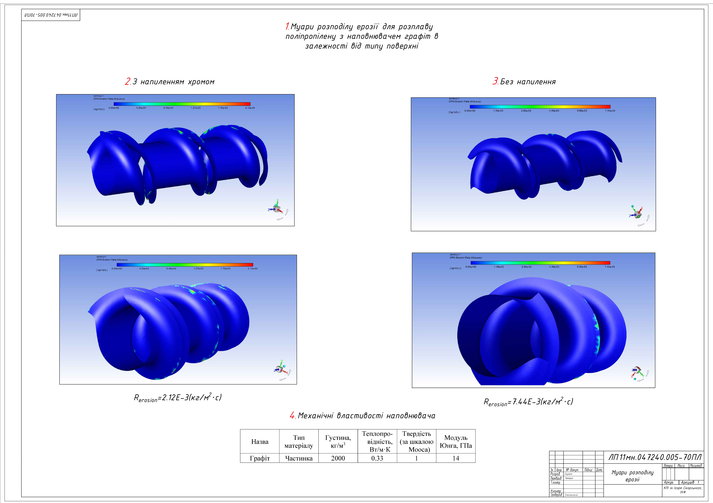

# NIKITA SKULKIN - MECHANICAL R&D & SIMULATION ENGINEER

**[View My Full CV (LinkedIn)](https://www.linkedin.com/in/nikita-skulkin)**

An MSc-qualified Mechanical Engineer specializing in FEA / Simulation Engineering with expert-level proficiency in both **ANSYS & Abaqus** environments. 

This portfolio showcases key R&D projects that demonstrate my capabilities in structural, thermal, and abrasive wear analysis.

---

### About Me

I am an MSc-qualified R&D and Mechanical Engineer specializing in FEA simulation (ANSYS, Abaqus) and complex CAD design.

Following my academic and R&D career, I relocated to the UK. My immediate priority was to gain practical, hands-on industry experience within the UK market and perfect my business-level English.

To achieve this, I took on Field Engineering and client-facing roles. This phase provided me with an invaluable understanding of how systems are commissioned, installed, and perform in real-world environments.

I am now focused on applying this unique combination of deep analytical skills and practical field experience to my core career in R&D and Mechanical Engineering.

---

## Project 1: R&D / CFD Simulation (ANSYS)
### Project: Increasing the Strength of Extruder Parts by Spraying (MSc Thesis)

**Objective:** To analyze and predict the mechanical erosion (abrasive wear) of extruder screws caused by various abrasive fillers and to prove the effectiveness of chrome-spraying.

**Methodology:** Developed an advanced numerical model (CFD) using **ANSYS** with the **Discrete Phase Model (DPM)** to simulate and map wear patterns.

**Key Findings:**
* Successfully mapped erosion patterns for fillers like glass fibre and graphite.
* **Proved that chrome-spraying increased component service life by up to 232%** when processing graphite-filled polymers.

*Caption: ANSYS model setup and mesh generation for the extruder screw. See English annotations below.*
***Key English Annotations:***
1.  Calculation Model
2.  Calculation Mesh (Grid)
3.  Initial Conditions
4.  Surface Definition: Cylinder Wall
5.  Surface Definition: Screw

*Caption: DPM erosion simulation results for Calcium Carbonate filler. English annotations below.*
***Key English Annotations:***
1.  Erosion Distribution Contours
2.  Without Spraying/Coating
3.  With Chrome Spraying/Coating
4.  Mechanical Properties of Filler
5.  Name: Calcium Carbonate

*Caption: DPM erosion simulation results for Chromium filler.*

*Caption: DPM erosion simulation results for Graphite filler.*

*Caption: DPM erosion simulation results for Fibre Glass filler.*

*Caption: Final data proving a 232% increase in component lifespan. English annotations below.*
***Key English Annotations:***
1.  Dependence of Erosion on the Influence of Different Fillers
2.  Erosion, mm/year
3.  Without Spraying
4.  Spraying - Chrome
5.  Increase in Service Life of the Extruder Screw
6.  Relative Value, %

---

## Project 2: FEA / Abrasive Wear Simulation (Abaqus)
### Project: Research on the Wear Process of the Extruder Screw (BSc Thesis)

**Objective:** To develop a predictive model using **Abaqus (FEA)** to calculate the abrasive wear and total service life of an extruder screw.

**Methodology:** Conducted an FEA simulation of a single quartz particle scratching the steel surface (Steel 38KhMYuA) to determine reaction forces and Von Mises stress.

**Key Findings:**
* Successfully simulated the stress and deformation caused by a single abrasive particle.
* Extrapolated the simulation data to calculate a total component lifespan of **T = 5000 hours**.

*Caption: FEA model in Abaqus showing particle/substrate setup and boundary conditions. English annotations below.*
***Key English Annotations:***
1.  Calculation Model
2.  Boundary Conditions
3.  Model of a Single Abrasive Particle
4.  Material Properties
5.  Density
6.  Young's Modulus

*Caption: Von Mises stress analysis of the steel substrate during the scratch test. English annotations below.*
***Key English Annotations:***
1.  Von Mises Stress
2.  Calculated Force Values
3.  Friction Force
4.  Support Reaction Force

*Caption: Final wear-to-pressure graph used to calculate the 5000-hour service life.*

---

### PROJECT 3: Engineering Automation (AutoLISP)
### Project: Parametric Shaft Design & Validation Tool (Academic R&D)

**Objective:** To automate and error-proof the creation of technical shaft drawings, a common and repetitive task in mechanical design. (Ref: *Coursework, KPI*)

**Methodology:** Developed a program entirely in **AutoLISP** for AutoCAD. The tool prompts the user for key parameters (diameters, lengths, etc.) and performs validation checks to ensure the inputs are logical and manufacturable.

**Result:** An automation script that instantly generates a complete, validated technical drawing. This tool drastically reduces design time (from hours to minutes) and eliminates the risk of human error in data entry.
*(Note: Project contains flowcharts for Program Algorithm and Input Data Validation).*

---

## Project 4: Mechanical CAD Design (SOLIDWORKS)
### Project: Retail POS Display & Industrial Machinery Design (Design Bureau Experience)

**Objective:** To design complex, multi-part assemblies for commercial and industrial use, focusing on Design for Manufacture (DFM).

**Methodology:** Used **SOLIDWORKS** and **AutoCAD** to create detailed 3D models, production-ready manufacturing drawings, and exploded-view assemblies.

*Caption: Exploded view of an extruder head assembly designed in SOLIDWORKS.*

*Caption: Detailed technical drawing for an extruder screw (from academic project). English annotations below.*
***Key English Annotations:***
1.  Screw / Worm Screw
2.  Material: Steel 38KhMYuA (Nitriding Steel)
3.  Surface Finish: Polish to Ra 0.20
4.  Designed by / Checked by

*Caption: 3D render of a tensegrity (levitating) POS display.*

---

### PROJECT 5: 3D CAD Design (Heat Exchanger Assembly)

**Task:** To design a complete, multi-component shell and tube heat exchanger based on thermodynamic principles.

**Methodology:** This project involved creating a detailed 3D model of the full assembly from the ground up, including the shell, tube bundle, baffles, and flanges. This design directly relates to my academic research into heat transfer intensity and fluid dynamics.

**Result:** A detailed 3D assembly model of an industrial heat exchanger (from academic project).

**[Click here to view the interactive 3D Model on Autodesk A360](https://a360.co/38QWUZy)**

*Caption: DPM erosion simulation results for Calcium Carbonate filler.*
***Key English Annotations:***
* `Муари розподілу ерозії` = Erosion Distribution Contours
* `Без напилення` = Without Spraying/Coating
* `З напиленням хромом` = With Chrome Spraying/Coating
* `Механічні властивості...` = Mechanical Properties of Filler

*Caption: DPM erosion simulation results for Chromium filler.*

*Caption: DPM erosion simulation results for Graphite filler.*

*Caption: DPM erosion simulation results for Fibre Glass filler.*

*Caption: Final data proving a 232% increase in component lifespan.*
***Key English Annotations:***
* `Залежність ерозії...` = Dependence of Erosion on... Fillers
* `Ерозія, мм/рік` = Erosion, mm/year
* `Без напилення` = Without Spraying
* `Напилення - Хром` = Spraying - Chrome
* `Збільшення терміну служби...` = Increase in Service Life...
* `Відносне значення, %` = Relative Value, %

---

## Project 2: FEA / Abrasive Wear Simulation (Abaqus)
### Project: Research on the Wear Process of the Extruder Screw (BSc Thesis)

**Objective:** To develop a predictive model using **Abaqus (FEA)** to calculate the abrasive wear and total service life of an extruder screw.

**Methodology:** Conducted an FEA simulation of a single quartz particle scratching the steel surface (Сталь 38ХМЮА) to determine reaction forces and Von Mises stress.

**Key Findings:**
* Successfully simulated the stress and deformation caused by a single abrasive particle.
* Extrapolated the simulation data to calculate a total component lifespan of **T = 5000 hours**.

*Caption: FEA model in Abaqus showing particle/substrate setup and boundary conditions.*
***Key English Annotations:***
* `Розрахункова модель` = Calculation Model
* `Граничні умови` = Boundary Conditions
* `Модель одного абразивного зерна` = Model of a Single Abrasive Particle
* `Властивості матеріалів` = Material Properties
* `Густина` = Density
* `Модуль Юнга` = Young's Modulus

*Caption: Von Mises stress analysis of the steel substrate during the scratch test.*
***Key English Annotations:***
* `Напруження за Мізесом` = Von Mises Stress
* `Розрахункові значення сил` = Calculated Force Values
* `Сила тертя` = Friction Force
* `Сила реакції опори` = Support Reaction Force

*Caption: Final wear-to-pressure graph used to calculate the 5000-hour service life.*

---

### PROJECT 3: Engineering Automation (AutoLISP)
### Project: Parametric Shaft Design & Validation Tool (Academic R&D)

**Objective:** To automate and error-proof the creation of technical shaft drawings, a common and repetitive task in mechanical design. (Ref: *Coursework, KPI*)

**Methodology:** Developed a program entirely in **AutoLISP** for AutoCAD. The tool prompts the user for key parameters (diameters, lengths, etc.) and performs validation checks ("Блок-схема перевірки") to ensure the inputs are logical and manufacturable.

**Result:** An automation script that instantly generates a complete, validated technical drawing. This tool drastically reduces design time (from hours to minutes) and eliminates the risk of human error in data entry.
***Key English Annotations:***
* `Блок-схема алгоритму програми` = Program Algorithm Flowchart
* `Блок-схема перевірки введених даних` = Input Data Validation Flowchart

---

## Project 4: Mechanical CAD Design (SOLIDWORKS)
### Project: Retail POS Display & Industrial Machinery Design (Design Bureau Experience)

**Objective:** To design complex, multi-part assemblies for commercial and industrial use, focusing on Design for Manufacture (DFM).

**Methodology:** Used **SOLIDWORKS** and **AutoCAD** to create detailed 3D models, production-ready manufacturing drawings, and exploded-view assemblies.

*Caption: Exploded view of an extruder head assembly designed in SOLIDWORKS.*

*Caption: Detailed technical drawing for an extruder screw (from academic project), specifying materials and manufacturing principles.*
***Key English Annotations:***
* `Черв'як`: Screw / Worm Screw
* `Сталь 38ХМЮА`: Steel 38KhMYuA (Nitriding Steel)
* `Полірувати Ra 0,20`: Polish to Ra 0.20 (Surface Finish)
* `Розроб. / Перевір.` = Designed by / Checked by

*Caption: 3D render of a tensegrity (levitating) POS display.*

---

### PROJECT 5: 3D CAD Design (Heat Exchanger Assembly)

**Task:** To design a complete, multi-component shell and tube heat exchanger based on thermodynamic principles.

**Methodology:** This project involved creating a detailed 3D model of the full assembly from the ground up, including the shell, tube bundle, baffles, and flanges. This design directly relates to my academic research into heat transfer intensity and fluid dynamics.

**Result:** A detailed 3D assembly model of an industrial heat exchanger (from academic project).

**[Click here to view the interactive 3D Model on Autodesk A360](https://a360.co/38QWUZy)**

I am now focused on applying this unique combination of deep analytical skills and practical field experience to my core career in R&D and Mechanical Engineering.

---

## Project 1: R&D / CFD Simulation (ANSYS)
### Project: Increasing the Strength of Extruder Parts by Spraying (MSc Thesis)

**Objective:** To analyze and predict the mechanical erosion (abrasive wear) of extruder screws caused by various abrasive fillers and to prove the effectiveness of chrome-spraying.

**Methodology:** Developed an advanced numerical model (CFD) using **ANSYS** with the **Discrete Phase Model (DPM)** to simulate and map wear patterns.

**Key Findings:**
* Successfully mapped erosion patterns for fillers like glass fibre and graphite.
* **Proved that chrome-spraying increased component service life by up to 232%** when processing graphite-filled polymers.

*Caption: ANSYS model setup and mesh generation for the extruder screw.*
***Key Annotations (Translated):***
* `Розрахункова модель`: Calculation Model
* `Розрахункова сітка`: Calculation Mesh (Grid)
* `Початкові умови`: Initial Conditions
* `Визначення поверхні стінки циліндру`: Definition of Cylinder Wall Surface
* `Визначення поверхні шнеку`: Definition of Screw Surface

*Caption: DPM erosion simulation results for Calcium Carbonate filler.*
***Key Annotations (Translated):***
* `Муари розподілу ерозії`: Erosion Distribution Contours
* `Без напилення`: Without Spraying/Coating
* `З напиленням хромом`: With Chrome Spraying/Coating
* `Механічні властивості...`: Mechanical Properties of Filler
* `Назва`: Name (Карбонат-кальцію: Calcium Carbonate)

*Caption: DPM erosion simulation results for Chromium filler.*

*Caption: DPM erosion simulation results for Graphite filler.*

*Caption: DPM erosion simulation results for Fibre Glass filler.*

*Caption: Final data proving a 232% increase in component lifespan.*
***Key Annotations (Translated):***
* `Залежність ерозії від впливу...`: Dependence of Erosion on the Influence of Different Fillers
* `Ерозія, мм/рік`: Erosion, mm/year
* `Без напилення`: Without Spraying
* `Напилення - Хром`: Spraying - Chrome
* `Збільшення терміну служби шнека...`: Increase in Service Life of the Extruder Screw...
* `Відносне значення, %`: Relative Value, %

---

## Project 2: FEA / Abrasive Wear Simulation (Abaqus)
### Project: Research on the Wear Process of the Extruder Screw (BSc Thesis)

**Objective:** To develop a predictive model using **Abaqus (FEA)** to calculate the abrasive wear and total service life of an extruder screw.

**Methodology:** Conducted an FEA simulation of a single quartz particle scratching the steel surface (Сталь 38ХМЮА) to determine reaction forces and Von Mises stress.

**Key Findings:**
* Successfully simulated the stress and deformation caused by a single abrasive particle.
* Extrapolated the simulation data to calculate a total component lifespan of **T = 5000 hours**.

*Caption: FEA model in Abaqus showing particle/substrate setup and boundary conditions.*
***Key Annotations (Translated):***
* `Розрахункова модель`: Calculation Model
* `Граничні умови`: Boundary Conditions
* `Модель одного абразивного зерна`: Model of a Single Abrasive Particle
* `Властивості матеріалів`: Material Properties
* `Густина`: Density
* `Модуль Юнга`: Young's Modulus

*Caption: Von Mises stress analysis of the steel substrate during the scratch test.*
***Key Annotations (Translated):***
* `Напруження за Мізесом`: Von Mises Stress
* `Розрахункові значення сил`: Calculated Force Values
* `Сила тертя`: Friction Force
* `Сила реакції опори`: Support Reaction Force

*Caption: Final wear-to-pressure graph used to calculate the 5000-hour service life.*

---

### PROJECT 3: Engineering Automation (AutoLISP)
### Project: Parametric Shaft Design & Validation Tool (Academic R&D)

**Objective:** To automate and error-proof the creation of technical shaft drawings, a common and repetitive task in mechanical design. (Ref: *Coursework, KPI*)

**Methodology:** Developed a program entirely in **AutoLISP** for AutoCAD. The tool prompts the user for key parameters (diameters, lengths, etc.) and, as shown in the project's logic diagrams, **performs validation checks** ("Блок-схема перевірки") to ensure the inputs are logical and manufacturable.

**Result:** An automation script that instantly generates a complete, validated technical drawing. This tool drastically reduces design time (from hours to minutes) and eliminates the risk of human error in data entry.
***Key Annotations (Translated):Setting up...***
* `Блок-схема алгоритму програми`: Program Algorithm Flowchart
* `Блок-схема перевірки введених даних`: Input Data Validation Flowchart

---

## Project 4: Mechanical CAD Design (SOLIDWORKS)
### Project: Retail POS Display & Industrial Machinery Design (Design Bureau Experience)

**Objective:** To design complex, multi-part assemblies for commercial and industrial use, focusing on Design for Manufacture (DFM).

**Methodology:** Used **SOLIDWORKS** and **AutoCAD** to create detailed 3D models, production-ready manufacturing drawings, and exploded-view assemblies.

*Caption: Exploded view of an extruder head assembly designed in SOLIDWORKS.*

*Caption: Detailed technical drawing for an extruder screw (from academic project), specifying materials and manufacturing principles.*
***Key Annotations (Translated):***
* `Черв'як`: Screw / Worm Screw
* `Сталь 38ХМЮА`: Steel 38KhMYuA (Nitriding Steel)
* `Полірувати Ra 0,20`: Polish to Ra 0.20 (Surface Finish)
* `Розроб. (Розробив)`: Designed by
* `Перевір. (Переві

I am now focused on applying this unique combination of deep analytical skills and practical field experience to my core career in R&D and Mechanical Engineering.

---

## Project 1: R&D / CFD Simulation (ANSYS)
### Project: Increasing the Strength of Extruder Parts by Spraying (MSc Thesis)

**Objective:** To analyze and predict the mechanical erosion (abrasive wear) of extruder screws caused by various abrasive fillers and to prove the effectiveness of chrome-spraying.

**Methodology:** Developed an advanced numerical model (CFD) using **ANSYS** with the **Discrete Phase Model (DPM)** to simulate and map wear patterns.

**Key Findings:**
* Successfully mapped erosion patterns for fillers like glass fibre and graphite.
* **Proved that chrome-spraying increased component service life by up to 232%** when processing graphite-filled polymers.

*Caption: ANSYS model setup and mesh generation for the extruder screw.*

*Caption: DPM erosion simulation results showing high-wear areas.*

*Caption: Final data proving a 232% increase in component lifespan.*

---

## Project 2: FEA / Abrasive Wear Simulation (Abaqus)
### Project: Research on the Wear Process of the Extruder Screw (BSc Thesis)

**Objective:** To develop a predictive model using **Abaqus (FEA)** to calculate the abrasive wear and total service life of an extruder screw.

**Methodology:** Conducted an FEA simulation of a single quartz particle scratching the steel surface (Сталь 38ХМЮА) to determine reaction forces and Von Mises stress.

**Key Findings:**
* Successfully simulated the stress and deformation caused by a single abrasive particle.
* Extrapolated the simulation data to calculate a total component lifespan of **T = 5000 hours**.

*Caption: FEA model in Abaqus showing particle/substrate setup and boundary conditions.*

*Caption: Von Mises stress analysis of the steel substrate during the scratch test.*

*Caption: Final wear-to-pressure graph used to calculate the 5000-hour service life.*

---

### PROJECT 3: Engineering Automation (AutoLISP)
### Project: Parametric Shaft Design & Validation Tool (Academic R&D)

**Objective:** To automate and error-proof the creation of technical shaft drawings, a common and repetitive task in mechanical design. (Ref: *Coursework, KPI*)

**Methodology:** Developed a program entirely in **AutoLISP** for AutoCAD. The tool prompts the user for key parameters (diameters, lengths, etc.) and, as shown in the project's logic diagrams, **performs validation checks** ("Блок-схема перевірки") to ensure the inputs are logical and manufacturable.

**Result:** An automation script that instantly generates a complete, validated technical drawing. This tool drastically reduces design time (from hours to minutes) and eliminates the risk of human error in data entry.

---

## Project 4: Mechanical CAD Design (SOLIDWORKS)
### Project: Retail POS Display & Industrial Machinery Design (Design Bureau Experience)

**Objective:** To design complex, multi-part assemblies for commercial and industrial use, focusing on Design for Manufacture (DFM).

**Methodology:** Used **SOLIDWORKS** and **AutoCAD** to create detailed 3D models, production-ready drawings, and exploded-view assemblies.

*Caption: Exploded view of an extruder head assembly designed in SOLIDWORKS.*

*Caption: Detailed technical drawing for an extruder screw (from academic project), specifying materials and manufacturing principles.*

*Caption: 3D render of a tensegrity (levitating) POS display.*

---

### PROJECT 5: 3D CAD Design (Heat Exchanger Assembly)

**Task:** To design a complete, multi-component shell and tube heat exchanger based on thermodynamic principles.

**Methodology:** This project involved creating a detailed 3D model of the full assembly from the ground up, including the shell, tube bundle, baffles, and flanges. This design directly relates to my academic research into heat transfer intensity and fluid dynamics.

**Result:** A detailed 3D assembly model of an industrial heat exchanger (from academic project).

**[Click here to view the interactive 3D Model on Autodesk A360](https://a360.co/38QWUZy)**
