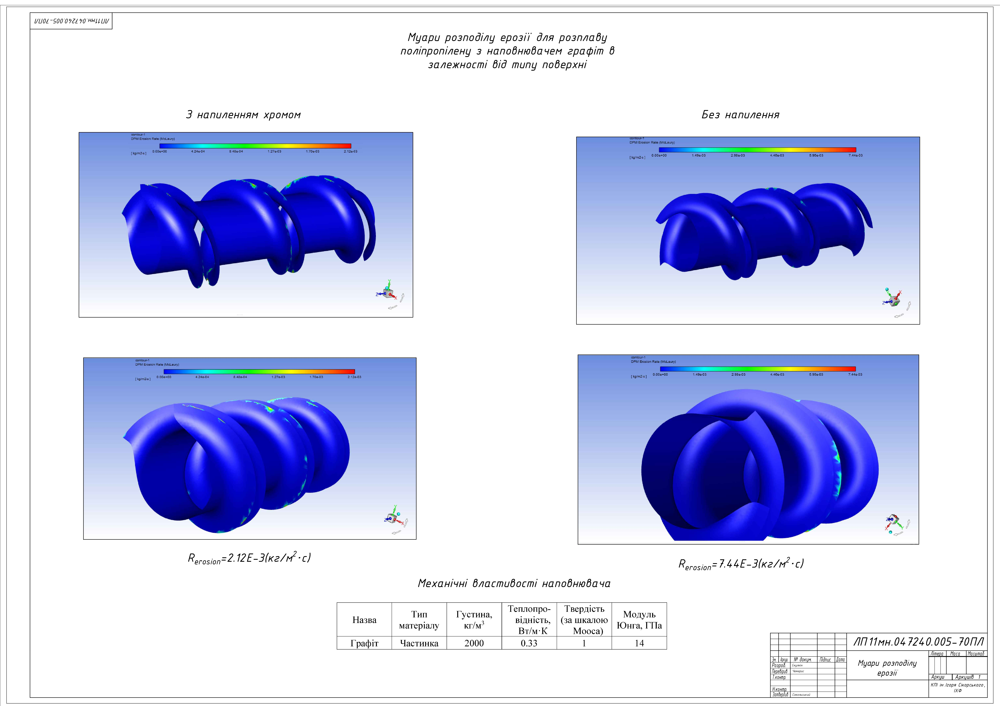
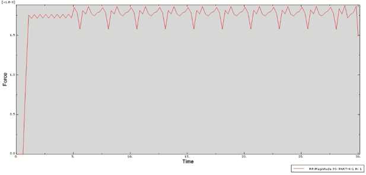
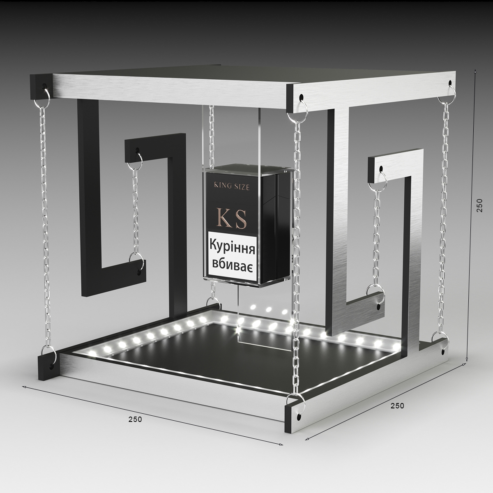

# NIKITA SKULKIN - MECHANICAL R&D & SIMULATION ENGINEER

**[View My Full CV (LinkedIn)](https://www.linkedin.com/in/nikita-skulkin)**

An MSc-qualified Mechanical Engineer specializing in FEA / Simulation Engineering with expert-level proficiency in both **ANSYS & Abaqus** environments. 

This portfolio showcases key R&D projects that demonstrate my capabilities in structural, thermal, and abrasive wear analysis.

---

### About Me

I am an MSc-qualified R&D and Mechanical Engineer specializing in FEA simulation (ANSYS, Abaqus) and complex CAD design.

Following my academic and R&D career, I relocated to the UK. My immediate priority was to gain practical, hands-on industry experience within the UK market and perfect my business-level English.

To achieve this, I took on Field Engineering and client-facing roles. This phase provided me with an invaluable understanding of how systems are commissioned, installed, and perform in real-world environments.

I am now focused on applying this unique combination of deep analytical skills and practical field experience to my core career in R&D and Mechanical Engineering.

---

## Project 1: R&D / CFD Simulation (ANSYS)
### Project: Increasing the Strength of Extruder Parts by Spraying (MSc Thesis)

**Objective:** To analyze and predict the mechanical erosion (abrasive wear) of extruder screws caused by various abrasive fillers and to prove the effectiveness of chrome-spraying.

**Methodology:** Developed an advanced numerical model (CFD) using **ANSYS** with the **Discrete Phase Model (DPM)** to simulate and map wear patterns.

**Key Findings:**
* Successfully mapped erosion patterns for fillers like glass fibre and graphite.
* **Proved that chrome-spraying increased component service life by up to 232%** when processing graphite-filled polymers.

*Caption: ANSYS model setup and mesh generation for the extruder screw.*

*Caption: DPM erosion simulation results showing high-wear areas.*

*Caption: Final data proving a 232% increase in component lifespan.*

---

## Project 2: FEA / Abrasive Wear Simulation (Abaqus)
### Project: Research on the Wear Process of the Extruder Screw (BSc Thesis)

**Objective:** To develop a predictive model using **Abaqus (FEA)** to calculate the abrasive wear and total service life of an extruder screw.

**Methodology:** Conducted an FEA simulation of a single quartz particle scratching the steel surface (Сталь 38ХМЮА) to determine reaction forces and Von Mises stress.

**Key Findings:**
* Successfully simulated the stress and deformation caused by a single abrasive particle.
* Extrapolated the simulation data to calculate a total component lifespan of **T = 5000 hours**.

*Caption: FEA model in Abaqus showing particle/substrate setup and boundary conditions.*

*Caption: Von Mises stress analysis of the steel substrate during the scratch test.*

*Caption: Final wear-to-pressure graph used to calculate the 5000-hour service life.*

---

## Project 3: Mechanical CAD Design (SOLIDWORKS)
### Project: Retail POS Display & Industrial Machinery Design (Design Bureau Experience)

**Objective:** To design complex, multi-part assemblies for commercial and industrial use, focusing on Design for Manufacture (DFM).

**Methodology:** Used **SOLIDWORKS** and **AutoCAD** to create detailed 3D models, production-ready drawings, and exploded-view assemblies.

*Caption: Exploded view of an extruder head assembly designed in SOLIDWORKS.*

*Caption: Production-ready drawing for an extruder screw (Сталь 38ХМЮА).*

*Caption: 3D render of a tensegrity (levitating) POS display.*

---

### PROJECT 4: 3D CAD Design (Heat Exchanger Assembly)

**Task:** To design a complete, multi-component shell and tube heat exchanger based on thermodynamic principles.

**Methodology:** This project involved creating a detailed 3D model of the full assembly from the ground up, including the shell, tube bundle, baffles, and flanges. This design directly relates to my academic research into heat transfer intensity and fluid dynamics.

**Result:** A verifiable, production-ready 3D model of a complex industrial apparatus.

**[Click here to view the interactive 3D Model on Autodesk A360](https://a360.co/38QWUZy)**
